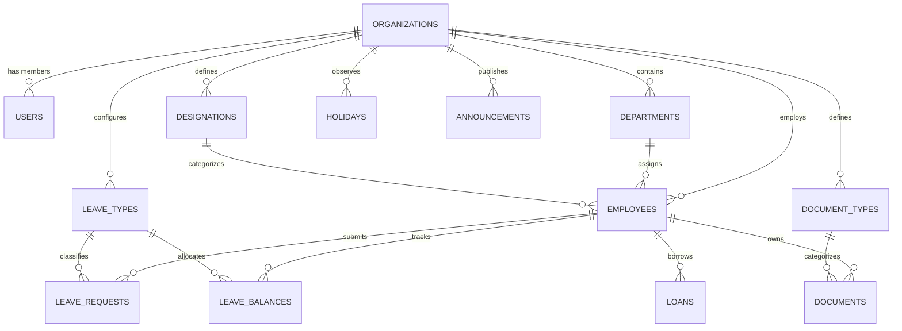

# Data Shapes & Entity Relationships

This document outlines the inferred data schemas and relational models derived from DOM inspection, form payloads, and application tables.

---

## Inferred Relational Schema

---

## Entity 1: `organizations`

| Field | Type | Constraints | Description |
| :--- | :--- | :--- | :--- |
| `id` | UUID / BIGINT | PK | Primary identifier |
| `name` | VARCHAR(255) | NOT NULL | Company legal name |
| `slug` | VARCHAR(100) | UNIQUE, NOT NULL | Subdomain identifier (e.g. `acme`) |
| `currency` | VARCHAR(10) | NOT NULL, DEFAULT 'AED' | Base operational currency |
| `phone` | VARCHAR(50) | NULLABLE | Contact phone |
| `industry` | VARCHAR(100) | NULLABLE | Industry sector |
| `plan_id` | VARCHAR(50) | NOT NULL, DEFAULT 'free' | Active subscription plan |
| `created_at` | TIMESTAMPTZ | NOT NULL | Creation timestamp |

---

## Entity 2: `employees`

| Field | Type | Constraints | Description |
| :--- | :--- | :--- | :--- |
| `id` | UUID / BIGINT | PK | Employee ID |
| `org_id` | UUID / BIGINT | FK -> `organizations.id` | Multi-tenant tenant key |
| `user_id` | UUID / BIGINT | FK -> `users.id`, NULLABLE | Associated portal user login |
| `employee_code` | VARCHAR(50) | NOT NULL | Unique employee code (e.g. `EMP-001`) |
| `first_name` | VARCHAR(100) | NOT NULL | First name |
| `last_name` | VARCHAR(100) | NOT NULL | Last name |
| `email` | VARCHAR(255) | NOT NULL | Work / personal email |
| `phone` | VARCHAR(50) | NULLABLE | Contact telephone |
| `department_id` | UUID / BIGINT | FK -> `departments.id` | Assigned department |
| `designation_id` | UUID / BIGINT | FK -> `designations.id` | Job title position |
| `joining_date` | DATE | NOT NULL | Date of joining |
| `status` | ENUM | `active`, `probation`, `terminated`, `on_leave` | Status |
| `salary_basic` | NUMERIC(12,2) | NOT NULL, DEFAULT 0 | Basic monthly salary |
| `created_at` | TIMESTAMPTZ | NOT NULL | Creation timestamp |

---

## Entity 3: `leave_requests`

| Field | Type | Constraints | Description |
| :--- | :--- | :--- | :--- |
| `id` | UUID / BIGINT | PK | Request ID |
| `org_id` | UUID / BIGINT | FK -> `organizations.id` | Multi-tenant tenant key |
| `employee_id` | UUID / BIGINT | FK -> `employees.id` | Applicant employee |
| `leave_type_id` | UUID / BIGINT | FK -> `leave_types.id` | Annual, Sick, etc. |
| `start_date` | DATE | NOT NULL | Leave start date |
| `end_date` | DATE | NOT NULL | Leave end date |
| `days_count` | NUMERIC(4,1) | NOT NULL | Total computed leave days |
| `reason` | TEXT | NULLABLE | Reason provided |
| `status` | ENUM | `pending`, `approved`, `rejected`, `cancelled` | Workflow status |
| `approved_by` | UUID / BIGINT | FK -> `users.id`, NULLABLE | Approving admin |
| `created_at` | TIMESTAMPTZ | NOT NULL | Submission timestamp |

---

## Entity 4: `documents`

| Field | Type | Constraints | Description |
| :--- | :--- | :--- | :--- |
| `id` | UUID / BIGINT | PK | Document ID |
| `org_id` | UUID / BIGINT | FK -> `organizations.id` | Multi-tenant tenant key |
| `employee_id` | UUID / BIGINT | FK -> `employees.id` | Associated employee |
| `document_type_id` | UUID / BIGINT | FK -> `document_types.id` | Category |
| `document_number` | VARCHAR(100) | NULLABLE | ID / Policy / Visa number |
| `issue_date` | DATE | NULLABLE | Date of issue |
| `expiry_date` | DATE | NULLABLE | Expiration date |
| `file_url` | TEXT | NOT NULL | Storage path / signed URL |
| `file_size` | BIGINT | NOT NULL | File size in bytes |
| `created_at` | TIMESTAMPTZ | NOT NULL | Upload timestamp |
