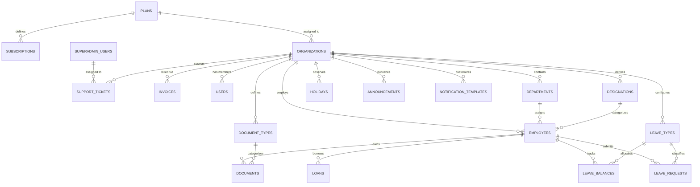

# Data Shapes & Entity Relationships (100% Full Platform Schema)

This document outlines the complete relational data models derived from DOM inspection, form payloads, table extractions, and API routes across both **Super Admin Platform** and **Tenant Workspaces**.

---

## 1. Master Relational Schema (Platform + Tenant)

---

## 2. Super Admin Global Entities

### Entity: `plans`
| Field | Type | Constraints | Description |
| :--- | :--- | :--- | :--- |
| `id` | UUID | PK | Plan identifier |
| `name` | VARCHAR(100) | NOT NULL | Plan name (e.g. Starter, Growth, Enterprise) |
| `slug` | VARCHAR(100) | UNIQUE, NOT NULL | Machine code (`free`, `pro`, `enterprise`) |
| `max_employees` | INTEGER | NOT NULL | Maximum active employee limit |
| `max_storage_mb` | INTEGER | NOT NULL | Storage allowance |
| `price_aed` | NUMERIC(10,2) | NOT NULL | Price in AED |
| `price_usd` | NUMERIC(10,2) | NOT NULL | Price in USD |
| `price_sar` | NUMERIC(10,2) | NOT NULL | Price in SAR |
| `features` | JSONB | NOT NULL | Feature capability flags |
| `is_active` | BOOLEAN | DEFAULT true | Visibility in registration wizard |

### Entity: `subscriptions`
| Field | Type | Constraints | Description |
| :--- | :--- | :--- | :--- |
| `id` | UUID | PK | Subscription ID |
| `org_id` | UUID | FK -> `organizations.id` | Tenant organization |
| `plan_id` | UUID | FK -> `plans.id` | Associated tier plan |
| `status` | VARCHAR(50) | NOT NULL | `active`, `past_due`, `canceled`, `trialing` |
| `currency` | VARCHAR(10) | NOT NULL | Billing currency (AED, USD, SAR) |
| `amount` | NUMERIC(10,2) | NOT NULL | Subscription recurring rate |
| `current_period_start` | TIMESTAMPTZ | NOT NULL | Cycle start timestamp |
| `current_period_end` | TIMESTAMPTZ | NOT NULL | Renewal / Expiry timestamp |
| `trial_ends_at` | TIMESTAMPTZ | NULLABLE | Free trial expiration date |

### Entity: `invoices`
| Field | Type | Constraints | Description |
| :--- | :--- | :--- | :--- |
| `id` | UUID | PK | Invoice primary key |
| `org_id` | UUID | FK -> `organizations.id` | Billed tenant |
| `invoice_number` | VARCHAR(100) | UNIQUE, NOT NULL | Sequential invoice code (`INV-2026-001`) |
| `amount` | NUMERIC(10,2) | NOT NULL | Billed total amount |
| `tax_amount` | NUMERIC(10,2) | DEFAULT 0.00 | VAT / Tax amount |
| `currency` | VARCHAR(10) | NOT NULL | Currency code |
| `status` | VARCHAR(50) | NOT NULL | `paid`, `open`, `void`, `uncollectible` |
| `paid_at` | TIMESTAMPTZ | NULLABLE | Payment timestamp |

### Entity: `support_tickets`
| Field | Type | Constraints | Description |
| :--- | :--- | :--- | :--- |
| `id` | UUID | PK | Ticket identifier |
| `org_id` | UUID | FK -> `organizations.id` | Originating tenant |
| `user_id` | UUID | FK -> `users.id` | Submitter user |
| `subject` | VARCHAR(255) | NOT NULL | Issue title |
| `category` | VARCHAR(100) | NOT NULL | `billing`, `technical`, `hr_feature`, `bug` |
| `priority` | VARCHAR(50) | NOT NULL | `low`, `medium`, `high`, `urgent` |
| `status` | VARCHAR(50) | NOT NULL | `open`, `in_progress`, `resolved`, `closed` |

---

## 3. Tenant Workspace Entities

### Entity: `organizations`
| Field | Type | Constraints | Description |
| :--- | :--- | :--- | :--- |
| `id` | UUID | PK | Primary identifier |
| `name` | VARCHAR(255) | NOT NULL | Company legal name |
| `slug` | VARCHAR(100) | UNIQUE, NOT NULL | Subdomain identifier (e.g. `acme`) |
| `currency` | VARCHAR(10) | NOT NULL, DEFAULT 'AED' | Base operational currency |
| `phone` | VARCHAR(50) | NULLABLE | Contact phone |
| `industry` | VARCHAR(100) | NULLABLE | Industry sector |
| `plan_id` | VARCHAR(50) | NOT NULL, DEFAULT 'free' | Active plan slug |
| `created_at` | TIMESTAMPTZ | NOT NULL | Creation timestamp |

### Entity: `employees`
| Field | Type | Constraints | Description |
| :--- | :--- | :--- | :--- |
| `id` | UUID | PK | Employee ID |
| `org_id` | UUID | FK -> `organizations.id` | Multi-tenant isolation key |
| `user_id` | UUID | FK -> `users.id`, NULLABLE | Associated portal user login |
| `employee_code` | VARCHAR(50) | NOT NULL | Unique employee code (e.g. `EMP-001`) |
| `first_name` | VARCHAR(100) | NOT NULL | First name |
| `last_name` | VARCHAR(100) | NOT NULL | Last name |
| `email` | VARCHAR(255) | NOT NULL | Work / personal email |
| `phone` | VARCHAR(50) | NULLABLE | Contact mobile |
| `dob` | DATE | NULLABLE | Date of birth (used for default EMP login) |
| `joining_date` | DATE | NOT NULL | Employment start date |
| `department_id` | UUID | FK -> `departments.id` | Department allocation |
| `designation_id` | UUID | FK -> `designations.id` | Job designation |
| `basic_salary` | NUMERIC(12,2)| DEFAULT 0.00 | Base compensation |
| `status` | VARCHAR(50) | DEFAULT 'active' | `active`, `on_leave`, `terminated` |

### Entity: `documents`
| Field | Type | Constraints | Description |
| :--- | :--- | :--- | :--- |
| `id` | UUID | PK | Document ID |
| `org_id` | UUID | FK -> `organizations.id` | Tenant isolation key |
| `employee_id` | UUID | FK -> `employees.id` | Owner employee |
| `document_type_id` | UUID | FK -> `document_types.id` | Passport, Visa, Labor Card, Emirates ID |
| `document_number` | VARCHAR(100)| NULLABLE | Official document/id reference |
| `file_path` | VARCHAR(500)| NOT NULL | Supabase Storage path |
| `issue_date` | DATE | NULLABLE | Document issue date |
| `expiry_date` | DATE | NOT NULL | Compliance expiration date |
| `alert_sent_90` | BOOLEAN | DEFAULT false | 90-day alert flag |
| `alert_sent_60` | BOOLEAN | DEFAULT false | 60-day alert flag |
| `alert_sent_30` | BOOLEAN | DEFAULT false | 30-day alert flag |

### Entity: `leave_requests`
| Field | Type | Constraints | Description |
| :--- | :--- | :--- | :--- |
| `id` | UUID | PK | Request ID |
| `org_id` | UUID | FK -> `organizations.id` | Tenant isolation key |
| `employee_id` | UUID | FK -> `employees.id` | Submitting employee |
| `leave_type_id` | UUID | FK -> `leave_types.id` | Annual, Sick, Maternity, Unpaid |
| `start_date` | DATE | NOT NULL | Leave start date |
| `end_date` | DATE | NOT NULL | Leave end date |
| `total_days` | NUMERIC(4,1)| NOT NULL | Calculated working days |
| `reason` | TEXT | NULLABLE | Application reason |
| `status` | VARCHAR(50) | DEFAULT 'pending' | `pending`, `approved`, `rejected` |
| `approved_by` | UUID | FK -> `users.id`, NULLABLE | Actioning manager |

### Entity: `loans`
| Field | Type | Constraints | Description |
| :--- | :--- | :--- | :--- |
| `id` | UUID | PK | Loan transaction ID |
| `org_id` | UUID | FK -> `organizations.id` | Tenant isolation key |
| `employee_id` | UUID | FK -> `employees.id` | Borrower employee |
| `principal_amount` | NUMERIC(12,2)| NOT NULL | Loan disbursement amount |
| `monthly_installment`| NUMERIC(12,2)| NOT NULL | Monthly EMI deduction |
| `repaid_amount` | NUMERIC(12,2)| DEFAULT 0.00 | Total repaid to date |
| `status` | VARCHAR(50) | DEFAULT 'active' | `active`, `paid_off`, `rejected` |
