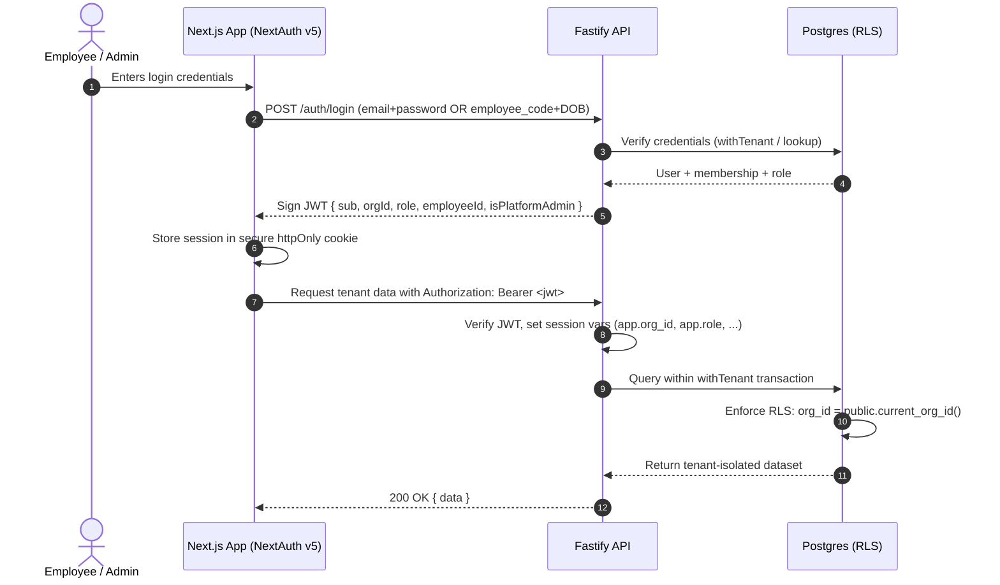
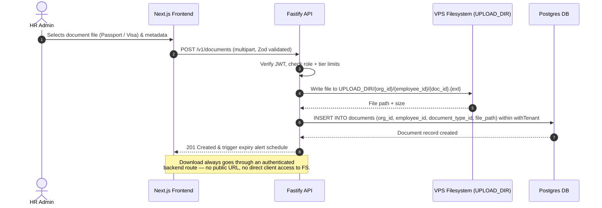

# Modernized User Flows & Architecture

This document describes the modern Next.js + Fastify + self-hosted PostgreSQL user flows for the replatformed system.

---

## 1. Unified Tenant & Employee Authentication Flow

---

## 2. Secure Document Upload & Download Flow

